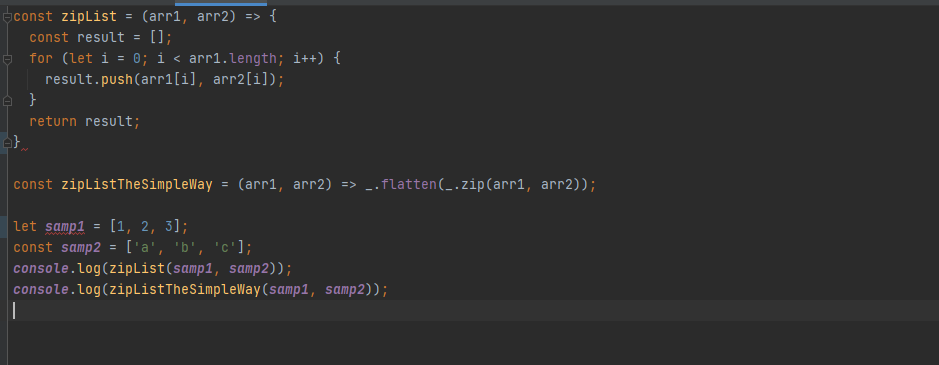

## Readability
Coding standards make code easier to read. If I am working with a group of people and everyone is using their own formating, then I would probably get confused when
I have to cross reference code. On the other hand, coding standard allows programmers to follow a specific formating, so multiple people can read the code without the
headache. In an extreme case, I would not want to read 50 lines of code that is crammed in 1 line. Since everyone is using a standard, the code will look 
the same.

## Improving JavaScript Knowledge
The coding standards helped me understand something in JavaScript. I didn't quite understand the const declaration until ESLint flagged me for using the let declaration
instead of the const. ESLint explained that the variable was not reassigned or changed, so I should use a const declaration. With this simple coding standard correction,
I was understand why const declarations are used. Also, I would not put semicolons after my function variables, and I would have ESLint errors after every function. 
I am not used to putting semicolons after functions because Java did not require it. However, I declared the function like a variable with the arrow function, and variables
should have a semicolon at the end of the statement. 

## Time Consuming
During the practice WODs, I would get ESLint errors that I do not understand at all. One error included the arrow function. I am getting used to the arrow functions, but
it seems that there are a bunch of syntax standards that come with the arrow function. I got the correct output, but the ESLint checker was not happy with my code.
I would spend a good portion of the practice WOD fixing my ESLint errors. I am trying to implement the coding standard that ESLint eforces, so I do not have to spend a 
lot of my time fixing ESLint errors.

## Conclusion
I am still getting used to the coding standards, and I find out something new and interesting when ESLint throws a error. I can see how and why coding standards 
help industrial and open source code. The coding standard should be enforced in those field, so the format of the code is the same. It is important to learn about and
enforce, so noone gets a headache.

   
