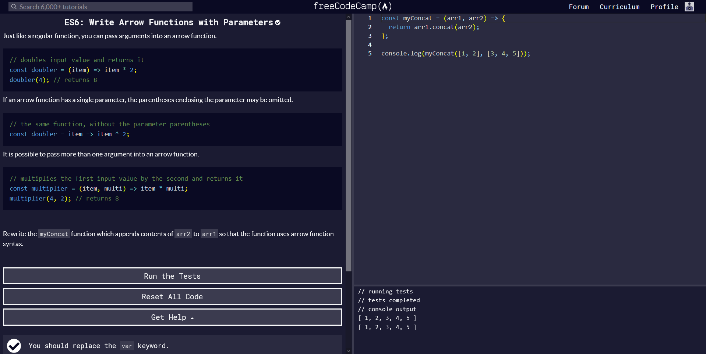

## FreeCodeCamp Course

The FreeCodeCamp course was a fun and interactive way to learn JavaScript. Most of the challenges on FreeCodeCamp were review, but I needed a review on programming. Also, I learned a bunch of new features in the ES6 section of the course. After starting the JavaScript section, I want to finish the rest of the JavaScript section and look at the other courses the site offers.
 

 
## JavaScript Thoughts

I found that JavaScript has very similar syntax to Java, but JavaScript does not require data types when declaring variables. I have a habit of declaring my variables with "int" or "String", but in JavaScript, I just have to type "var" or "let" when declaring variables. Also, the functions do not require specified data type parameters and can return multiple datatypes. I can see how the loose data type feature can be beneficial because you do not need to plan all of the data types needed for a function. However, I think there can be problems with the organization and semantics with the feature. Also, a new programmer may have issues with debugging JavaScript code because there is no discrete label for the data type. After watching the lectures about JavaScript, I am curious about why JavaScript is not used in certain fields.

## JavaScript ES6

The ES6 section of JavaScript seemed the most confusing because the syntax in JavaScript seem foreign. I have never seen functions defined like a variable before. I still do not understand how function-like variables are used, but C, and Java are unable to define a function like a variable. The arrow function seemed to be useful because it simplified the creation of a function. I can see myself utilizing the arrow function quite a bit. Also, the destructuring assignment seems useful when accessing values in an object, but I would like to practice the syntax more.

## JavaScript WOD

I was able to practice typing JavaScript syntax with the practice Workout of The Day. The athletic software engineering pedagogy seems engaging and promotes practice. The ICS314 website only provides one or two practice WODs, so I would be able to check my understanding of the subject before the real WOD.

## Conclusion

JavaScript is a useful language to know. I read a bunch of articles about how JavaScript is widely used in the Software Engineering industry, and I would like to improve my skill in JavaScript. I am looking forward to practicing more JavaScript and implement JavaScript code in web development. Hopefully, one day I can say I mastered a programming language, and I am leaning towards mastering JavaScript.
