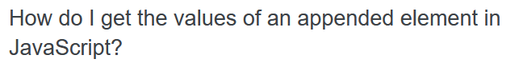

## Smart Question

I stumbled upon this question on Stack Overflow about a JavaScript string feature, "use strict". The user's console threw errors about the statement, "use strict", was missing
in his JavaScript code. He stated that he added the statement to his code, and the console error disappeared. However, he wanted to know more about what the statement
means and why he needs to include it. He attempted to research about the statement on Google, but he was not able to find any details. Therefore, he presented his question
to Stack Overflow. 
  
The Stack Overflow community flooded the post with answer. Many of the answers are references to articles, and the users gave their own input on what "use strict" means.
The question is from 2009, but it is still relevant to new JavaScript programmers. In fact, the answers to the post are still being updated. I think this is a good, smart
question for that time because the user who asked the question did research before asking the question. I emphasize "for that time" because, if a user asked the question
today(2021) on Stack Overflow, they would be bombarded with "STFW" answers. At the time this question was posted, there probably was not much easy to access resources
that provided answers. In fact, the question was asked around the time ECMAscript 5 was released, and "use strict" was a new feature in ECMAscript 5. This question
contributed to the community by shedding light on a new feature of JavaScript. When I search "use strict Javascript" on Google today, the Stack Overflow forum from 2009
is one of the top result which shows that the question is stil relevant.

## Not so Smart, Lazy Question

In contrast, the above question is not a smart question. A user reading the question can interpret the question in many ways and conclude that the question is
not worth answering. I would have assumed that the question pertained to arrays or some data structure. Also, as the question states, "How do I get the values of an
appended element in JavaScript?", the answer seems trivial, and Googling the answer would suffice. However, the question does not have to do anything with data structures.
The author of the post wants to get the value of a HTML element in JavaScript. The description of the problem has very little detail and confused many readers.
In the post, there is long reply chain between the author and a Stack Overflow user and the user is trying to pry more information out of the author.
If the question was more specific and the description was clearer, then the author could have gotten an answer sooner and with less pain. 

## Conclusion
Asking smart question as a software engineer is important because we do not know everything and technology is everchanging. We want to have a systematic approach to asking a 
question, so the asker and askee will benefit in the time spent. The Stack Overflow question boards is a good place to get an answer that solves a problem, but if one can't ask the right questions, then the problem will still linger. As a result, I hope to improve my questioning ability to improve my chances of getting an answer in a timely manner.
     
Links to the questions:  [Smart Question](https://stackoverflow.com/questions/1335851/what-does-use-strict-do-in-javascript-and-what-is-the-reasoning-behind-it)   [Not Smart Question](https://stackoverflow.com/questions/65929562/how-do-i-get-the-values-of-an-appended-element-in-javascript)
  

