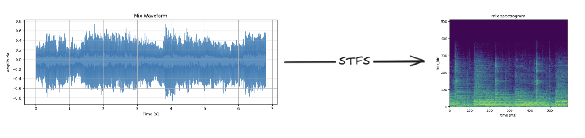
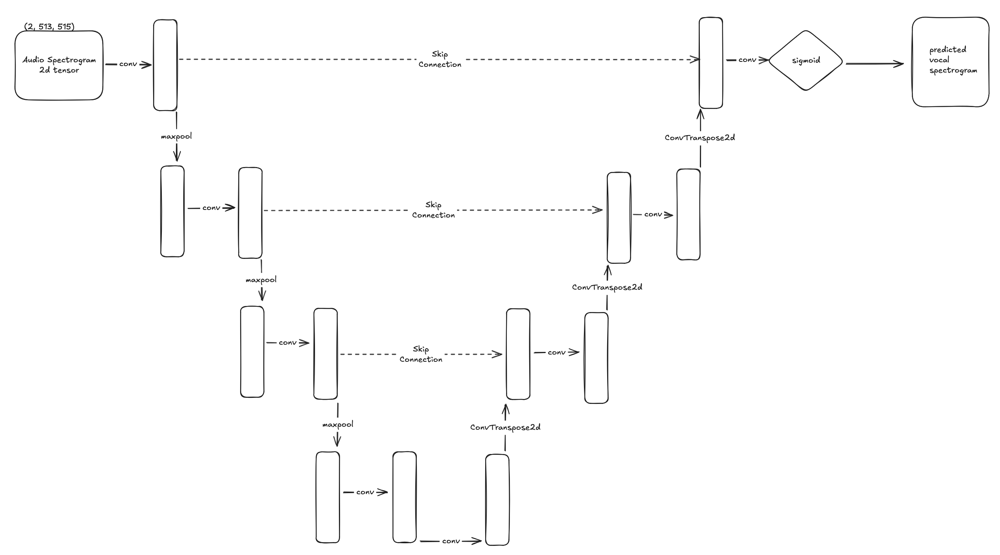
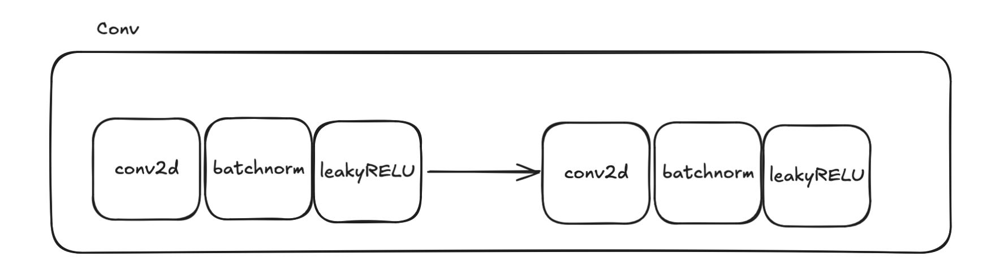
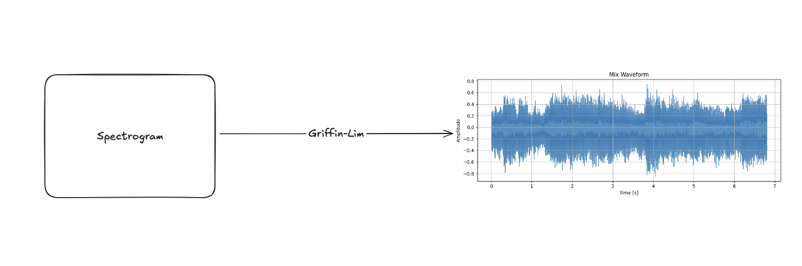
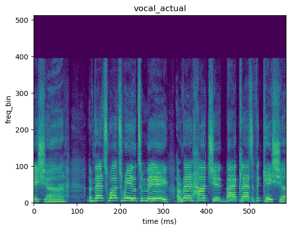

The purpose of this project was not to create a state of the art vocal
extractor, but to recreate a naive method of the vocal extraction. I attempted
to build my own UNET architecture from scratch and modified it to fit my
requirements. I learned quite a bit from this project because I have never
built and/or trained a model. The results are not the best, but I have ideas
of how to improve it after reading other methods.

## Methods

I converted audio waveform (time-domain) data into a spectrogram
(frequency-domain) to get frequency data from the audio. I decided this will
lead to better exctraction of the vocals because waveforms only hold the
intensity value at each time instead of the intensity of the frequencies. If I
can use the intensity of the frequency, the model can spot where the frequency
intensity is highest for vocals as opposed to the accompaniment frequencies.

I recreated a UNET architecture built in Pytorch and modified it to take a 2D
spectrogram array as an input.

Each convolution step had two 2D convolution layers with a batch normalization
and leakyReLU activation function. 2D convolution layers were used because the
input is 2D array, so the learned features would include both right and left
channels of the spectrogram data. Then, a batch normalization is used to
stabilize the results which prevented the output of the convolution to become
unstable. LeakyReLU is probably not needed because the output of the function
should not be negative since the input is all positive numbers from 0-1. However,
just incase, negative values do get outputted from the convolution layers,
leakyReLU would be able to incorporate those values in the activation function.

I used Griffin-Lim algorithim to convert the power spectrogram back into audio.
The Griffin-Lim algorithm attempts to reconstruct the phase of the audio. Since
Griffin-Lim is only an approximation, the results of the audio will not be the
most accurate.

## Results

 
  
  

<iframe width="560" height="315" src="https://www.youtube.com/embed/aTVulUuLlNQ?si=u6CE5KLoCk9weZcC" title="YouTube video player" frameborder="0" allow="accelerometer; autoplay; clipboard-write; encrypted-media; gyroscope; picture-in-picture; web-share" referrerpolicy="strict-origin-when-cross-origin" allowfullscreen></iframe>

There seems to be a lot of static noise within the predicted vocals. I am
assuming that there are a lot of little values, non-audible noise, in the audio
data that got exponentiated when running it through my model. However, I would
have though since the model is trying to match the values of the target vocals,
the noise values would be minimized. I can possibly try to run the output of
the model through a Weiner filter which is what Wave-Net does to remove any
noise. I could also debug the model to see where these values are being
exploded. There are many ways I could try to improve this model.

Website: Coming Soon
Paper: <a href="../pdf/ICS483_Final_Project.pdf">PDF</a>
Source: <a href="https://github.com/skimura1/VocalExtractionUnet"><i class="large github icon "></i>skimura1/VocalExtractionUnet</a>

