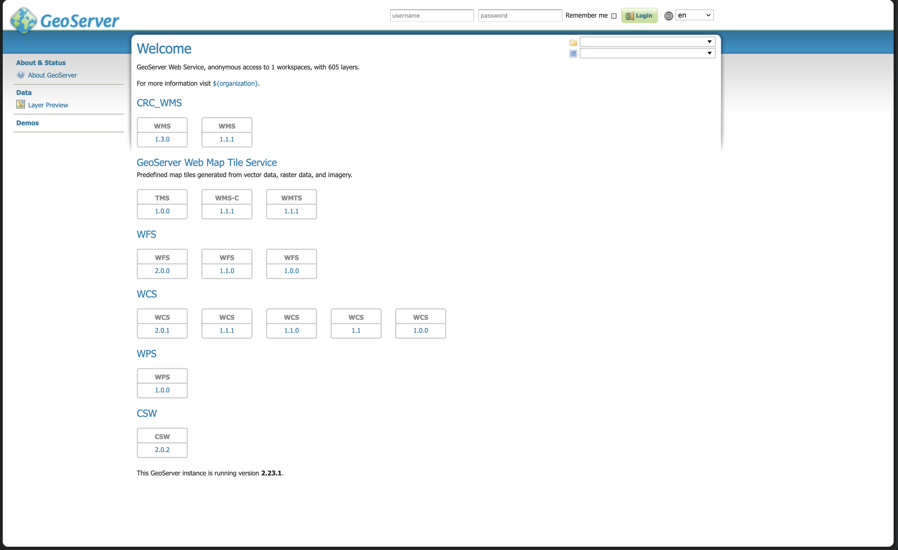

I setup an instance of Geoserver that acts as middleware for GIS data.
Geoserver utilizes Open Geopstial Consortium (OGC) standards to serve GIS data
layers to applications which includes Web Map Services (WMS), Web Map Tile
Service (WMTS), Web Feature Service (WFS), Web Coverage Service (WCS), Web
Processing Service (WPS), and Catalog Service for the Web (CSW). We use WMS and
WFS to serve data to our web mapping application, SOEST Climate Viewer. And we
provide a WMS for users to interface with data using GIS software. I am the
admin and maintain operation for the server that hosts the Geoserver instance.

Github: <a href="https://github.com/Climate-Resilience-Collaborative/geoserver-docker">Geoserver Docker</a>
