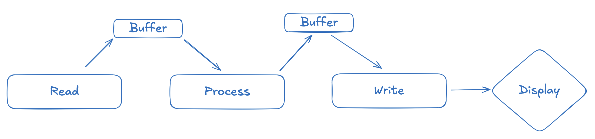

<div class="text-center p-4">
    
    
    
</div>

The app is a simple image processing app that utilizes multiple threads in
order to apply filters images. This app is built with Javafx and is forked from
my Professor's (Henri Casanova) main app. The main task is to implement
multiple threads within the pipeline of processing the images to paralelize
each step of the process. That is, multiple steps of the process can be run
at the same time. As opposed to, only one step at a time.



The app uses a consumer-producer scheme in order to "pass" each image to the
next processing step. I use a thread-safe buffer using Java's Array Blocking
Queue to hold the "workers" created by the job window which holds the path of
the images to be processed. Then, the images are read into the buffer. When 
the buffer is full the read thread will be put to sleep until the process thread
is ready to process another image, and the buffer is able to take in another
image. Likewise, the process thread will put the filtered images into another
buffer until it is full, then it will be put to sleep. Once the writer thread
is done writing the filtered image to the disk and displaying to the job
window, the process thread will wake up to process another image to be put into
the buffer.

The consumer-producer scheme allows the read, process and write thread to be
executing a task in parallel, so one thread does not have to wait for the other
to finish unless the buffer is full. The task parallelization in general sped
up the application, but the processing step would bottleneck the pipeline if
the image is very large. Therefore, the oil4 filter would be still slow despite
task parallelization.

Another example of a filter that would slow down the processing pipeline would be
a median filter which convolves a box filter and taking the median of neighbor
pixels. To solve this issue, I used data parallelization to have threads apply the
filter on different sections of the image. This allows multiple threads to be apply
the filter on the image at the same time. I split the rows of the image by the
number of processing threads that are spawned. For images that don't split
evenly among the threads, I used integer division to round the number up. Then,
if the number of rows assigned to the last thread is greater than the image
height, I set the max row value to the image height, so the last thread may
have less rows to process. I implemented a slider to spawn the number of
processing threads.

<div class="text-center p-4">
    <figure>
        
        <figcaption>Regular Temple</figcaption>
    </figure>
    <figure>
        
        <figcaption>JPEGedge Filter Temple</figcaption>
    </figure>
</div>

The last task of the class is to use C++'s OpenMP API to parallelize filter's
written in C++. Each filter requires a three nested for loops in order to
compute a value for each pixel in an image. The for loop is split into smaller
iterations to be done in parallel. The basis of the data parallelization with
OpenMP is shown in the code block below.

```cpp
#pragma omp parallel shared(input_image, output_image) private(row, col, rgb)
    {
        #pragma omp for
        for (row = 0; row < input_image->height; row++) {
            for (col = 0; col < input_image->width; col++) {
                for (rgb=0; rgb < 3; rgb++) {
                    output_image->RGB[rgb][row * input_image->width + col] =
                            compute_pixel_value(input_image, row, col, rgb);
                }
            }
        }
    }

```


Source: <a href="https://github.com/skimura1/Multithreaded-Photo-App"><i class="large github icon "></i>skimura1/multithreaded-photo-app</a>
