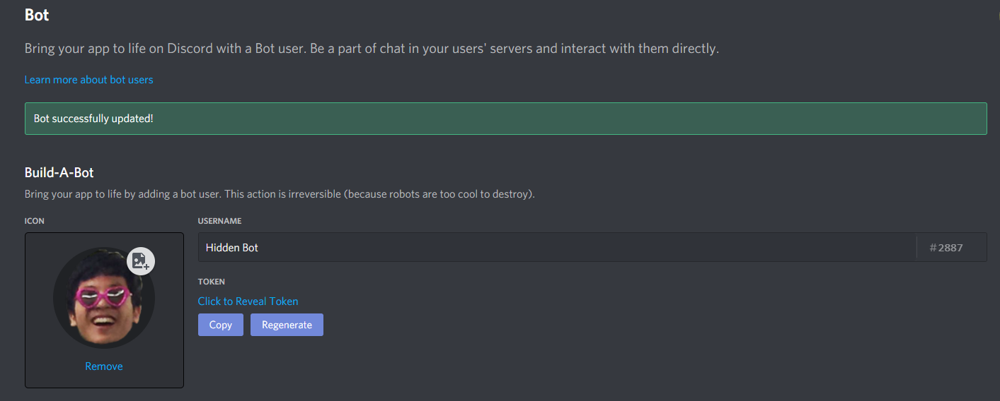
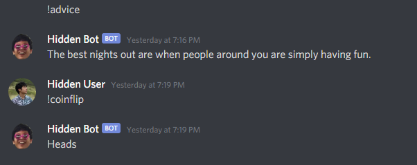
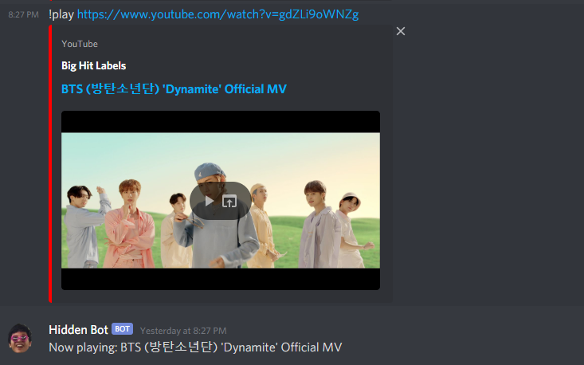

The discord bot was a fun idea I had over the winter break. I followed a hour long tutorial: <a href="https://www.youtube.com/watch?v=SPTfmiYiuok">https://www.youtube.com/watch?v=SPTfmiYiuok</a>.
The video introduced repl.it which is an IDE that you can run code in the cloud for free. After finishing the tutorial, I wanted to add more 
features to the bot, but the tutorial's bot format did not suffice. I had to recreate the bot with online documentation and resources.
The tutorial based commands on client events (messages in a channel), but I had to use the bot class provided by discord.py in order to turn
python functions into commands for the bot.

The bot is able to do various functions, but I am not done adding features. The bot can give advice to a user that types "!advice", and the bot
will respond with advice taken from a randomly generated advice API. The bot can flip a coin when a user types "!flip" which is taken from a coin
flipping API. It can add two numbers together when a user types "!add 1 2" which is a trivial function. Lastly, the most challenging task was to 
make the bot join a voice channel and play music from a YouTube link. I had to read the discord.py documentation in order to find specific parameters for objects.
Also, I had to look through a bunch of forums to finally integrate the feature to my bot. I had to use a python library called, "youtube_dl.py" which allowed
me to grab the audio from a YouTube video from a link. 

I learned quite a bit from a simple project. I was able to brush up on my Python and utilize scripting functions. I was unfamiliar with getting data from an
API until I had to request the data from a API and access a JSON file to send data to Discord. Since I was unfamiliar with the discord.py library, I got to practice
reading library documentations. Lastly, I found out about the repl.it IDE which can be useful in the future.
 
Source Code: <a href="https://github.com/skimura1/Hidden-Bot">GitHub</a>   <a href="https://repl.it/@SkylerKim1/Hidden-Bot#main.py">Repl.it</a>
   
