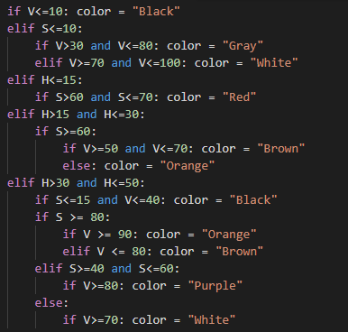

The drone had to be able to recognize targets with letters and two colors. The script entire script was not written by me, but it was passed down to me from previous members of
the team. The previous members inputted HSV values based on strict ranges which worked well with primary colors. However, the script had trouble with recognizing many shades of colors. Also, the original script had trouble recognizing the color of the target and the color of the letter inside of the target.

I had to modify the script to fix the false color recognition. Originally, the script can only test one target at a time, so I had to modify it to test
multiple targets at a time. I would test the targets and verify whether the primary (target) and secondary (letter) colors were correct. If they were not correct, I would have
to modify the HSV value ranges in the script. I found way to break the HSV spectrum into ranges to generalize the color shades.

For the project, I was able to practice Python skills in this project and learn how to use the command line to run Python code. Since I had to determine colors with HSV values, I 
learned how HSV values work and applied them to the script. The script was passed down to me, so I practice reading documentation from previous team members. 
