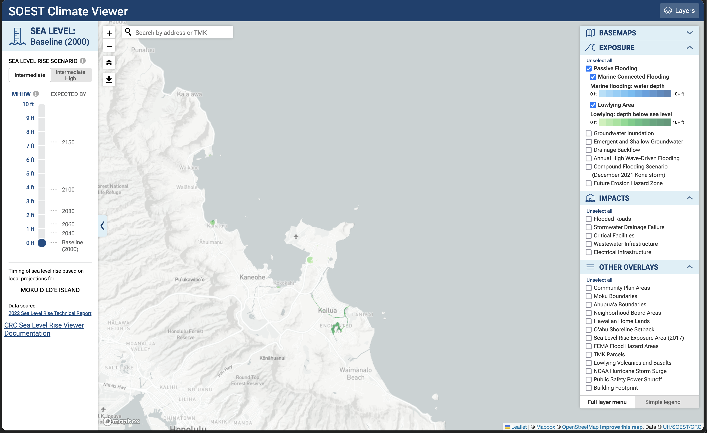

<a href="https://www.soest.hawaii.edu/crc/slr-viewer">Climate Viewer Link</a>

I developed a web mapping tool in Leaflet.js that displays geospatial data on
future sea level rise scenarios. The map is available in three basemaps:
Grayscale, Satellite, and Sattelite with no labels. Dataset layers are split up
between three categories: Exposure, Impacts, and Other Overlays. When a user
clicks on the checkbox next to the option on the layer menu (right menu), the
data layer is displayed on the map in its respective color. The colorbar legend
is displayed under the layer option to show depth at each tile layer in the
location on the map. The vertical slider bar displayed on the left side of the
screen displays the foot sea level rise increment scenario that is expected by
a certain year. When the user slides the slider, a new layer is displayed to
reflect the predicted scenario data. For certain data layers, a user can click
on the data tile layer on the map to display the depth increment at that location.
The right menu is able to turn into a simple legend to only display the selected
data layer legend icon or color bar. 

The viewer uses Leaflet.js plugins to help with the development of the menus and 
improve the displaying of the data.

For more technical details about each layer, check out the <a
  href="https://www.soest.hawaii.edu/crc/index.php/climate-viewer-documentation-page/#sea-level-rise-scenarios">documentation
  website</a> that I built.

The viewer is a frontend display of the data that is hosted in a Geoserver.
